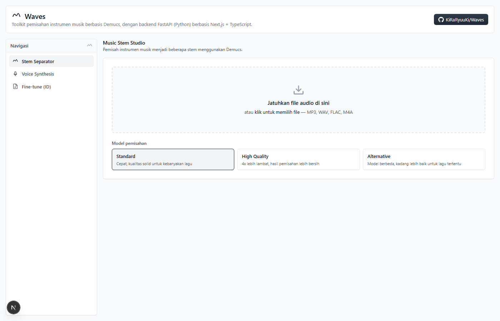
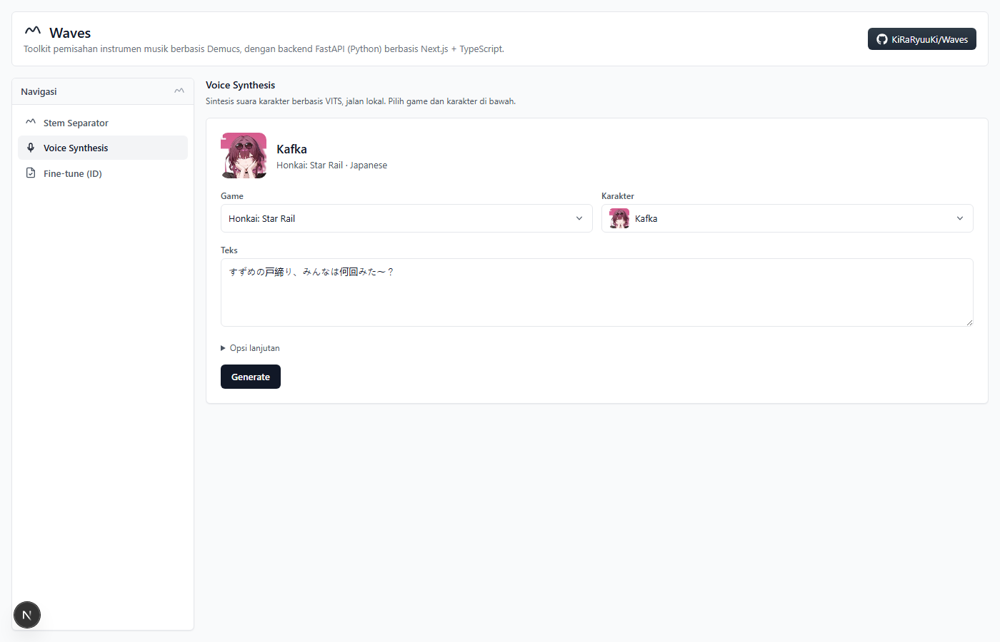
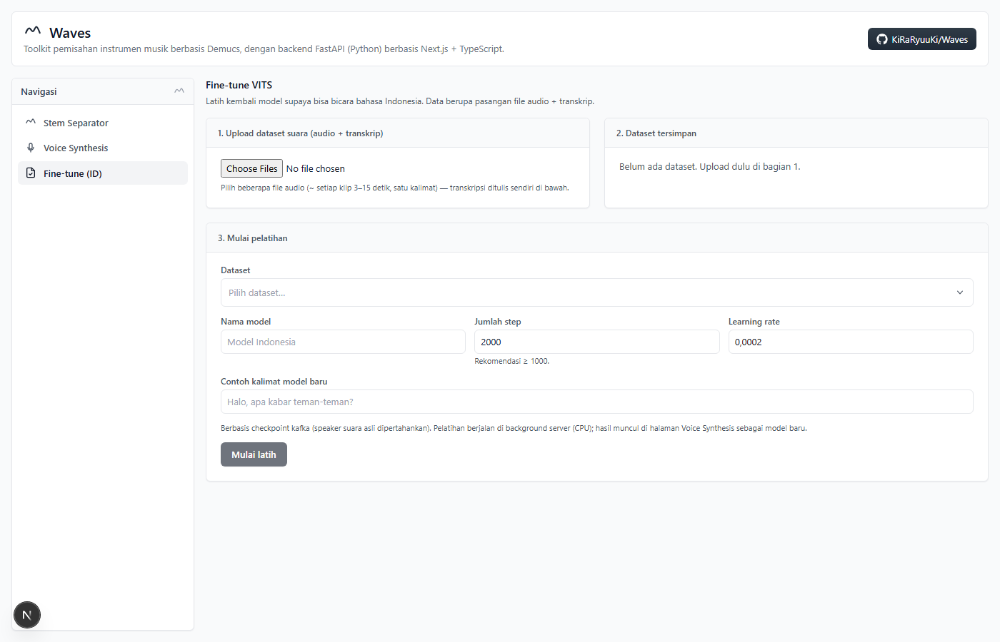

<p style="font-size: 2em; font-weight: 700; line-height: 1.2; margin: 0.67em 0; padding-top: 8px;">Waves</p>

**Toolkit Audio AI: Pemisahan Stem, Sintesis Suara Karakter, dan Fine-tune VITS**

Waves dirancang sebagai studio audio berbasis AI yang berjalan sepenuhnya lokal, dengan menyediakan tiga alur kerja utama: memisahkan lagu menjadi stem track, menyintesis suara karakter, hingga melatih ulang model suara dengan dataset sendiri. Aplikasi ini mengintegrasikan Demucs (pemisahan sumber audio) dan VITS (text-to-speech) dengan antarmuka mixer yang intuitif semua pemrosesan dilakukan di perangkat Anda tanpa bergantung pada layanan cloud.

🔗 **Repository**: [https://github.com/KiRaRyuuKi/Waves](https://github.com/KiRaRyuuKi/Waves)

## 📸 Screenshots

### Stem Separator
Tampilan utama Waves untuk upload lagu, memilih model Demucs, dan menampilkan riwayat unggahan.



### Voice Synthesis
Sintesis suara karakter berbasis VITS dengan pemilihan game & karakter, konfigurasi speaker, dan generation suara langsung.



### Fine-tune VITS (ID)
Halaman untuk melatih ulang model kafka agar bisa berbicara bahasa Indonesia, lengkap dengan manajemen dataset dan status pelatihan.



## 🚀 Fitur Utama

- **Pemisahan Stem**: Memisahkan lagu menjadi 4 stem (vocals, drums, bass, other) dengan model Demucs
- **3 Pilihan Model**: Standard (`htdemucs` cepat), High Quality (`htdemucs_ft` lebih bersih), dan Alternative (`mdx_extra`)
- **Mixer Studio Real-time**: Fader volume, mute/solo, level meter per-track, dan waveform klik-untuk-seek (Web Audio API)
- **Export Mix Kustom**: Merender kombinasi fader/mute/solo menjadi file .wav langsung di browser (OfflineAudioContext)
- **Voice Synthesis**: Suara karakter berbasis VITS yang berjalan lokal, dengan banyak karakter & speaker
- **Fine-tune VITS**: Latih model kafka supaya bicara bahasa Indonesia dari dataset audio + transkrip sendiri
- **Riwayat & Pemulihan**: Unggahan terbaru, job yang gagal bisa dijalankan ulang, dan riwayat bisa dihapus
- **Offline-first**: Kode Demucs di-vendor penuh; bobot model hanya perlu diunduh sekali

## 🛠️ Teknologi yang Digunakan

- **Frontend**: Next.js 15 (App Router), React 19, TypeScript, Tailwind CSS
- **Backend**: Python, FastAPI, Uvicorn
- **Audio ML**: Demucs 4 (di-vendor), PyTorch, VITS
- **Audio di Browser**: Web Audio API, OfflineAudioContext, AnalyserNode
- **Proksi**: Next.js `rewrites()` meneruskan `/api/*` ke FastAPI (port 8000)

## 📋 Persyaratan Sistem

- Node.js 18.x (atau lebih baru) dan NPM
- Python 3.10+ (disarankan 3.11/3.12)
- **FFmpeg** terpasang & berada di PATH (untuk membaca berbagai format audio)
- Koneksi internet **saat pertama kali** memakai model Demucs (untuk mengunduh bobot model, ratusan MB)

## ⚙️ Instalasi dan Setup

### 1. Clone Repository
```bash
git clone https://github.com/KiRaRyuuKi/Waves.git
cd Waves
```

### 2. Setup Backend (Python)
```bash
python -m venv .venv

# Windows
.venv\Scripts\activate
# Linux/macOS
source .venv/bin/activate

pip install -r requirements.txt
```

`requirements.txt` menginstall Demucs dari folder lokal `vendor/demucs` (bukan
`pip install git+https://...`), jadi proses ini tidak butuh akses ke GitHub sama sekali.

### 3. Install Dependencies Frontend
```bash
npm install
```

### 4. Jalankan Server Backend
```bash
uvicorn server.main:app --port 8000
```

### 5. Jalankan Development Server Frontend
```bash
npm run dev
```

Buka [http://localhost:3000](http://localhost:3000) — Next.js otomatis meneruskan
request `/api/*` ke backend di port 8000, jadi **kedua server harus jalan bersamaan**.

## 📑 Struktur Direktori

```txt
Waves/
├── server/                      # Backend Python (FastAPI) — jangan dinamai "app"
│   ├── main.py                  # API: upload, status job, download stem, retry, hapus
│   ├── jobs.py                  # Job store (snapshot JSON + rekonsiliasi dari disk)
│   ├── separator.py             # Menjalankan Demucs & parsing progress live
│   ├── voice.py                 # TTS VITS (katalog model, synthesize, cover)
│   ├── tts.py                   # Inti inferensi VITS
│   ├── training.py              # Router endpoint fine-tune
│   ├── finetune.py              # Pipeline pelatihan VITS dari dataset
│   └── storage/
│       ├── models/              # Model suara VITS + katalog info.json
│       ├── uploads/             # File audio yang di-upload user
│       ├── separated/           # Hasil pemisahan stem
│       └── datasets/            # Dataset fine-tune
├── vendor/demucs/               # Sumber Demucs di-vendor (offline, tanpa GitHub)
├── src/                         # Frontend Next.js 15 (App Router) + TypeScript
│   ├── app/                     # layout.tsx, page.tsx, voice/, training/
│   ├── components/              # App, Mixer, ChannelStrip, VoiceStudio, TrainStudio, Dropdown, dst.
│   └── lib/                     # api.ts, audioEngine.ts, wavEncoder.ts, peaks.ts, voiceApi.ts, trainingApi.ts
├── docs/
│   ├── logo/                    # Logo proyek
│   └── screenshots/             # Screenshot antarmuka
├── requirements.txt
├── package.json
├── next.config.js               # Proxy /api/* → backend FastAPI (localhost:8000)
└── README.md
```

## 🔧 Penggunaan

### Workflow Stem Separator
1. Pada halaman utama, seret/klik file audio (MP3, WAV, FLAC, M4A).
2. Pilih model: **Standard**, **High Quality**, atau **Alternative**.
3. Tunggu pemisahan selesai → mixer menampilkan 4 stem dengan waveform, fader, mute/solo.
4. Atur mix lalu klik **Export mix (.wav)**.
5. Unggahan yang gagal bisa diulang lewat tombol **Coba ulang pemisahan**; riwayat lama bisa dihapus lewat menu titik tiga di "Unggahan terbaru".

### Project Build
```bash
npm run build
npm run start
```

Untuk backend production, jalankan uvicorn tanpa `--reload` di belakang reverse proxy (nginx/caddy), atau bungkus dengan `gunicorn -k uvicorn.workers.UvicornWorker`.

### Catatan Model Offline
- Bobot model Demucs diunduh dari `dl.fbaipublicfiles.com` **saat pertama kali** dipakai, lalu disimpan di cache `~/.cache/torch/hub/checkpoints/` (Windows: `C:\Users\<nama>\.cache\torch\hub\checkpoints\`). Setelah itu semua proses pemisahan berjalan 100% offline.
- Jika mesin tidak punya internet sama sekali, unduh manual checkpoint berikut dari mesin lain lalu taruh di folder cache:
  - `htdemucs` → `955717e8-8726e21a.th` (`hybrid_transformer/`)
  - `htdemucs_ft` → `f7e0c4bc-ba3fe64a.th`, `d12395a8-e57c48e6.th`, `92cfc3b6-ef3bcb9c.th`, `04573f0d-f3cf25b2.th` (`hybrid_transformer/`)
  - `mdx_extra` → `e51eebcc-c1b80bdd.th`, `a1d90b5c-ae9d2452.th`, `5d2d6c55-db83574e.th`, `cfa93e08-61801ae1.th` (`mdx_final/`)

## 🛠️ Troubleshooting

- **`No module named 'demucs'`** — demucs terpasang *editable* dari `vendor/demucs`; jika folder aslinya dipindah, install ulang: `pip install -e "vendor/demucs"`.
- **`torchcodec` lib not found** — versi `torchaudio` terbaru mewajibkan `torchcodec`; sudah dipatch di `vendor/demucs/demucs/audio.py` untuk menyimpan WAV/FLAC via `soundfile`, tanpa `torchaudio.save`.
- **Separation selalu gagal** — `separator.py` memakai `sys.executable` (interpreter venv yang sama), bukan `python3` hardcoded. Pastikan backend dijalankan dari venv proyek.
- **`getaddrinfo failed` saat unduh bobot** — unduh manual checkpoint dengan `curl.exe -L` ke folder cache di atas, lalu restart backend.
- **`pip install` gagal soal batas versi** — longgarkan batas atas versi di `vendor/demucs/requirements_minimal.txt` (pola: `torchaudio>=0.8` tanpa batas atas).

## 🐛 Bug Reports & Feature Requests

Jika Anda menemukan bug atau ingin mengajukan fitur baru:

1. [**Bug Report**](https://github.com/KiRaRyuuKi/Waves/issues/new?template=bug_report.md)
2. [**Feature Request**](https://github.com/KiRaRyuuKi/Waves/issues/new?template=feature_request.md)

Pastikan untuk menyertakan informasi detail tentang masalah atau fitur yang diinginkan.

## 📞 Kontak

- **Email**        : m.ilham.v.28.07.2003@gmail.com
- **Phone**        : +6281234590357
- **GitHub**       : [@kiraryuuki](https://github.com/kiraryuuki)
- **Project Link** : [https://github.com/KiRaRyuuKi/Waves](https://github.com/KiRaRyuuKi/Waves)

---

<p align="center">
    <strong>
        Studio audio AI yang berjalan sepenuhnya lokal
    </strong>
    <br>
    Pemisahan stem, sintesis suara, dan fine-tune dalam satu tempat
</p>