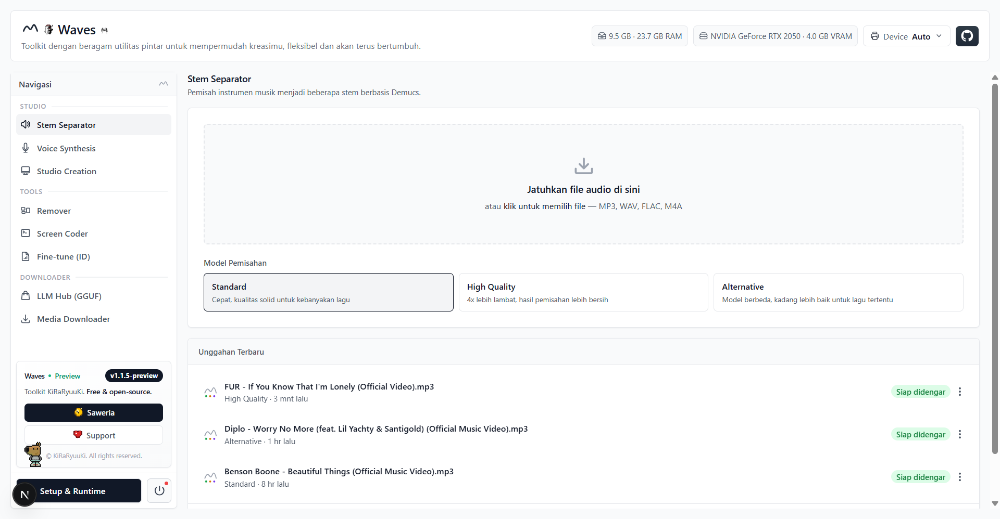

<p style="font-size: 2em; font-weight: 700; line-height: 1.2; margin: 0.67em 0; padding-top: 8px;">Waves</p>

**Toolkit Utilitas Pintar untuk Mempermudah Kreasimu, Fleksibel dan Akan Terus Bertumbuh**

Waves adalah toolkit dengan beragam utilitas pintar untuk mempermudah kreasimu. Setiap utilitas berdiri sendiri. Dapat kamu pakai untuk suatu saat, digabung, atau ditambah sendiri sesuai kebutuhan, tanpa terpaksa mengikuti satu alur kerja besar yang kaku. Semuanya berjalan lokal di perangkatmu, dari pemisahan stem, sintesis suara karakter, dan fine-tune model, sampai pembuatan gambar, video, hingga inference LLM.

Mulai dari pemisah lagu hari ini, pakai yang lain saat butuh. Hal ini akan terus bertambah mengikuti apa yang kamu butuhkan.

Saat ini tersedia sembilan utilitas: **Stem Separator**, **Music Studio**, **Voice Synthesis**, **Fine-tune (ID)**, **Studio Creation** (Image + Video), **Remover**, **LLM Hub (GGUF)**, **Screen Coder**, dan **Media Downloader**.

🔗 **Repository**: [https://github.com/KiRaRyuuKi/Waves](https://github.com/KiRaRyuuKi/Waves)

## 📸 Screenshots

Klik untuk membuka screenshots dengan navigasi `←` / `→`.

<a href="https://kiraryuuki.github.io/Waves/">
  
</a>

👉 **[Buka screenshots (11 gambar)](https://kiraryuuki.github.io/Waves/)**, tombol **Prev**/**Next**, tombol panah keyboard, thumbnail untuk lompat langsung, swipe di perangkat sentuh, dan klik gambar untuk layar penuh.

## 🚀 Fitur Utama

### 🎵 Audio & Suara

- **Pemisahan Stem**: Memisahkan lagu menjadi 4 stem (vocals, drums, bass, other) dengan model Demucs
- **3 Pilihan Model**: Standard (`htdemucs` cepat), High Quality (`htdemucs_ft` lebih bersih), dan Alternative (`mdx_extra`)
- **Mixer Studio Real-time**: Fader volume, mute/solo, level meter per-track, dan waveform klik-untuk-seek (Web Audio API)
- **Export Mix Kustom**: Merender kombinasi fader/mute/solo menjadi file .wav langsung di browser (OfflineAudioContext)
- **Voice Synthesis**: Suara karakter berbasis VITS yang berjalan lokal, dengan banyak karakter & speaker
- **Fine-tune VITS**: Latih model supaya bicara bahasa Indonesia dari dataset audio + transkrip sendiri

### 🎨 Visual & Video

- **Image Generation**: Generate gambar dengan Stable Diffusion (diffusers), model ditaruh manual di `server/storage/generate/image/`, tanpa unduh otomatis
- **Video Generation**: Buat video pendek dari teks dengan **AnimateDiff** (menempel ke model SD 1.5 yang sudah ada, ringan) atau **Wan 2.1 T2V 1.3B** (gerak lebih natural, lebih berat) dan hasil `.mp4` lewat FFmpeg
- **Remover**: Hapus background foto dengan model lokal (U²-Net, ISNet, Silueta)

### 🤖 AI & Produktivitas

- **LLM Hub (GGUF)**: Unduh model GGUF dari Hugging Face, konversi ke format Ollama, ekspor, dan hapus model lokal dari satu panel
- **Screen Coder**: Agent pengodean lokal dengan konfigurasi model sendiri tanpa API key cloud
- **Media Downloader**: Unduh media dari berbagai sumber ke folder lokal, lengkap dengan progres dan kecepatan unduhan

### ⚙️ Platform

- **Setup & Runtime**: Kelola versi Python, dependensi, dan bobot model (Demucs, VITS, Image, Video) lewat dialog unduhan langsung dengan progres live
- **Server Control**: Tombol start/stop/restart backend langsung dari sidebar
- **Riwayat & Pemulihan**: Unggahan terbaru, job yang gagal bisa dijalankan ulang, dan riwayat bisa dihapus
- **Offline-first**: Kode Demucs di-vendor penuh; bobot model hanya perlu diunduh sekali

## 🛠️ Teknologi yang Digunakan

- **Frontend**: Next.js 15 (App Router), React 19, TypeScript, Tailwind CSS
- **Backend**: Python 3.13, FastAPI, Uvicorn
- **Audio/Image ML**: Demucs 4 (di-vendor), PyTorch, VITS, Stable Diffusion (diffusers)
- **Video ML**: AnimateDiff, Wan 2.1 (diffusers), FFmpeg (encode H.264)
- **LLM**: GGUF (llama.cpp bindings, di-vendor) + Ollama
- **Audio di Browser**: Web Audio API, OfflineAudioContext, AnalyserNode
- **Proksi**: Next.js `rewrites()` meneruskan `/api/*` ke FastAPI (port 9035)
- **Pengujian**: `tests/security_regression.py` (smoke test keamanan, 39 assertion)

## 📋 Persyaratan Sistem

- Node.js 18.x (atau lebih baru) dan NPM
- Python 3.10+ (disarankan 3.11/3.12)
- **FFmpeg** terpasang & berada di PATH (untuk membaca berbagai format audio)
- Koneksi internet **saat pertama kali** memakai model Demucs (untuk mengunduh bobot model, ratusan MB) atau unduh lebih dulu lewat menu **Setup & Runtime** → **Stem Separator** supaya langsung siap pakai

## ⚙️ Instalasi dan Setup

### 1. Clone Repository
```bash
git clone https://github.com/KiRaRyuuKi/Waves.git
cd Waves
```

### 2. Setup Backend (Python)
```bash
python -m venv .venv

# Windows
.venv\Scripts\activate
# Linux/macOS
source .venv/bin/activate

pip install -r requirements.txt
```

`requirements.txt` menginstall Demucs dari folder lokal `vendor/stem` (bukan
`pip install git+https://...`), jadi proses ini tidak butuh akses ke GitHub sama sekali.

### 3. Install Dependencies Frontend
```bash
npm install
```

### 4. Jalankan Sekaligus (Backend + Frontend) (opsional)
Satu perintah menjalankan backend uvicorn dan frontend Next.js bersamaan di
background, membuka aplikasi otomatis di browser. Runner menampilkan terminal
bergaya installer: logo ASCII, menu navigasi panah (mode run & interface), log
ber-timestamp `[HH:MM:SS] [ok]`, dan spinner menunggu backend siap.

```bash
npm run waves
```

Runner akan:
- menampilkan *Choose Interface* (menu panah): Web UI / Background / Exit,
- cek & install otomatis dependensi Node/Python (venv + requirements) saat run pertama,
- menanyakan mode: *Development* (next dev) atau *Production* (next start),
- menulis status proses ke `.waves/state.json` agar server bisa dihentikan/di-restart
  dari tombol server di sidebar, atau perintah:
  ```bash
  npm stop waves       # sama dengan `npm stop` — hentikan semua server
  npm restart waves    # sama dengan `npm restart` — restart backend saja
  ```
  (`waves` di sini hanya penegas; `npm stop`/`npm restart` sendiri sudah cukup.)

Backend berjalan di `http://localhost:9035`, frontend di `http://localhost:3095`.
Lewati dialog interaktif dengan flag:
```bash
node scripts/start.mjs --mode=start        # langsung mode produksi (otomatis build bila perlu)
node scripts/start.mjs --mode=dev          # langsung mode development
node scripts/start.mjs --action=background # start tanpa membuka browser
node scripts/start.mjs --no-browser        # jalankan tapi jangan buka browser
node scripts/start.mjs --yes               # setujui otomatis semua prompt setup
```

### 5. Atau Jalankan Manual Terpisah

#### 5a. Server Backend
```bash
uvicorn server.waves:app --port 9035
```

#### 5b. Development Server Frontend
```bash
npm run dev
```

Buka [http://localhost:3095](http://localhost:3095) — Next.js otomatis meneruskan
request `/api/*` ke backend di port 9035, jadi **kedua server harus jalan bersamaan**.

## 📑 Struktur Direktori

```txt
Waves/
├── server/                      # Backend Python (FastAPI) — jangan dinamai "app"
│   ├── waves.py                 # App utama: upload job, CORS, security headers,
│   │                            # rate limit, Origin guard, exception handler
│   ├── uploads.py               # Helper batas ukuran upload (stream + hapus parsial)
│   ├── jobs.py                  # Job store (snapshot JSON atomik + rekonsiliasi disk)
│   ├── separator.py             # Menjalankan Demucs & parsing progress live
│   ├── image.py                 # Image generation Stable Diffusion (lokal-only)
│   ├── video.py                 # Video generation AnimateDiff + Wan 2.1 (lokal-only)
│   ├── voice.py                 # TTS VITS (katalog model, synthesize, cover)
│   ├── tts.py                   # Inti inferensi VITS + penjaga path model
│   ├── remover.py               # Hapus background foto (U²-Net / ISNet / Silueta)
│   ├── llm.py                   # LLM Hub: unduh GGUF, konversi, ekspor Ollama
│   ├── coder.py                 # Screen Coder agent + config (API key dimask)
│   ├── downloader.py            # Media Downloader
│   ├── devices.py               # Deteksi perangkat komputasi (CUDA/ROCm/CPU)
│   ├── setup.py                 # Setup & Runtime: Python, dependensi, unduh model
│   ├── training.py              # Router endpoint fine-tune + dataset
│   ├── finetune.py              # Pipeline pelatihan VITS dari dataset
│   └── storage/
│       ├── models/              # Model suara VITS + katalog info.json
│       ├── generate/
│       │   ├── image/           # Model Stable Diffusion (ditaruh manual, tanpa unduh)
│       │   └── video/           # Model video (AnimateDiff & Wan) + hasil .mp4
│       ├── uploads/             # File audio yang di-upload user
│       ├── separated/           # Hasil pemisahan stem
│       ├── datasets/            # Dataset fine-tune
│       └── jobs.json            # Riwayat job (tulis atomik)
├── vendor/stem/                 # Sumber Demucs di-vendor (offline, tanpa GitHub)
├── src/                         # Frontend Next.js 15 (App Router) + TypeScript
│   ├── app/                     # layout.tsx, page.tsx, voice/, training/, llm/, coder/, dst.
│   │   └── api/                 # Route handler Next.js (proxy + Origin guard)
│   ├── components/              # App, Mixer, ChannelStrip, VoiceStudio, TrainStudio, ImageStudio, VideoStudio, dst.
│   └── lib/                     # api.ts, audioEngine.ts, wavEncoder.ts, voiceApi.ts, imageApi.ts, videoApi.ts, dst.
│       └── api/originGuard.ts   # requireLocalOrigin() untuk proteksi CSRF
├── tests/
│   └── security_regression.py   # Smoke test keamanan (39 assertion)
├── docs/
│   ├── index.html               # Galeri screenshots interaktif (GitHub Pages)
│   ├── logo/                    # Logo proyek
│   ├── releases/                # Catatan rilis
│   └── screenshots/             # Screenshot antarmuka (11 PNG)
├── scripts/                     # start.mjs / stop.mjs / restart.mjs (runner daemon)
├── requirements.txt
├── package.json
├── next.config.js               # Proxy /api/* → backend FastAPI (localhost:9035)
└── README.md
```

## 🔧 Penggunaan

### Workflow Stem Separator
1. Pada halaman utama, seret/klik file audio (MP3, WAV, FLAC, M4A).
2. Pilih model: **Standard**, **High Quality**, atau **Alternative**.
3. Tunggu pemisahan selesai → mixer menampilkan 4 stem dengan waveform, fader, mute/solo.
4. Atur mix lalu klik **Export mix (.wav)**.
5. Unggahan yang gagal bisa diulang lewat tombol **Coba ulang pemisahan**; riwayat lama bisa dihapus lewat menu titik tiga di "Unggahan terbaru".

### Project Build
```bash
npm run build
npm run start
```

Untuk backend production, jalankan uvicorn tanpa `--reload` di belakang reverse proxy (nginx/caddy), atau bungkus dengan `gunicorn -k uvicorn.workers.UvicornWorker`.

### Catatan Model Offline
- Bobot model Demucs diunduh dari `dl.fbaipublicfiles.com` **saat pertama kali** dipakai, lalu disimpan di cache `~/.cache/torch/hub/checkpoints/` (Windows: `C:\Users\<nama>\.cache\torch\hub\checkpoints\`). Setelah itu semua proses pemisahan berjalan 100% offline.
- Atau, **unduh lebih dulu** lewat menu **Setup & Runtime** di aplikasi, pilih salah satu dari `Stem Model — Standard`, `High Quality`, atau `Alternative`, lalu unduh (dan jalankan ulang jika lama terputus). Setelah selesai bobot langsung tersimpan di cache dan siap dipakai tanpa menunggu unduhan pertama saat memisahkan lagu.
- Jika mesin tidak punya internet sama sekali, unduh manual checkpoint berikut dari mesin lain lalu taruh di folder cache:
  - `htdemucs` → `955717e8-8726e21a.th` (`hybrid_transformer/`)
  - `htdemucs_ft` → `f7e0c4bc-ba3fe64a.th`, `d12395a8-e57c48e6.th`, `92cfc3b6-ef3bcb9c.th`, `04573f0d-f3cf25b2.th` (`hybrid_transformer/`)
  - `mdx_extra` → `e51eebcc-c1b80bdd.th`, `a1d90b5c-ae9d2452.th`, `5d2d6c55-db83574e.th`, `cfa93e08-61801ae1.th` (`mdx_final/`)

### Catatan Model Video
- Bobot video **tidak diunduh saat generate**. Pasang lewat **Setup & Runtime**, kategori *model* dengan awalan **Video:**:
  - `Video: Motion Adapter AnimateDiff` (~1,8 GB) + `Video: CLIP Vision` (~1,7 GB) → untuk AnimateDiff (pakai model SD 1.5 yang sudah ada),
  - `Video: Wan 2.1 T2V 1.3B` (~28 GB) → untuk Wan (lebih berat; di GPU 4 GB jalan dengan *offload* ke RAM, jadi lambat).
- Butuh **FFmpeg** di PATH untuk meng-encode hasil menjadi `.mp4` (H.264).
- Model video disimpan di `server/storage/generate/video/` dan di-ignore git.

### Batas Upload

Semua endpoint upload dibatasi agar tidak bisa dipakai exhausting disk atau RAM. Kelebihan file ditolak `413` dan berkas parsial otomatis dihapus.

| Endpoint | Batas |
|---|---|
| `POST /api/jobs` (audio) | 500 MB per file |
| `POST /api/remover/remove` (gambar) | 20 MB per file |
| `POST /api/training/datasets` | 200 file, 100 MB per file, total ≤ 400 MB |

Nilai ini diatur di satu tempat: `server/uploads.py` (`MAX_AUDIO_UPLOAD`, `MAX_IMAGE_UPLOAD`, `MAX_DATASET_AUDIO`, `MAX_DATASET_FILES`).

## 🛠️ Troubleshooting

- **`No module named 'demucs'`**, demucs terpasang *editable* dari `vendor/stem`; jika folder aslinya dipindah, install ulang: `pip install -e "vendor/stem"`.
- **`torchcodec` lib not found**, versi `torchaudio` terbaru mewajibkan `torchcodec`; sudah dipatch di `vendor/stem/demucs/audio.py` untuk menyimpan WAV/FLAC via `soundfile`, tanpa `torchaudio.save`.
- **Separation selalu gagal**, `separator.py` memakai `sys.executable` (interpreter venv yang sama), bukan `python3` hardcoded. Pastikan backend dijalankan dari venv proyek.
- **`getaddrinfo failed` saat unduh bobot**, unduh manual checkpoint dengan `curl.exe -L` ke folder cache di atas, lalu restart backend.
- **`pip install` gagal soal batas versi**, longgarkan batas atas versi di `vendor/stem/requirements_minimal.txt` (pola: `torchaudio>=0.8` tanpa batas atas).

## 🧩 Vendor Forks

Waves mem-vendor beberapa upstream agar offline-first dan mudah dipatch:

| Vendor | Upstream | Catatan patch |
|--------|----------|---------------|
| `vendor/stem` | `facebookresearch/demucs` (MIT) | Patch `demucs/audio.py` hindari `torchaudio.save` → `soundfile` untuk `torchcodec` terbaru |
| `vendor/vits` | VITS TTS (Apache-2.0) | Diisolasi untuk inferensi lokal |
| `vendor/llama` | `ggml-org/llama.cpp` (MIT) | Bindings untuk LLM Hub (GGUF) model besar di-ignore git (`*.gguf`) |
| `vendor/coder` | ScreenCoder-style agent | Frontend + backend di-vendor untuk integrasi lokal `node_modules`/`dist` di-ignore |

Hindari edit `vendor/*` tanpa catat upstream commit/tag di PR. Lihat `CONTRIBUTING.md` → Vendor Forks.

## 🤝 Contributing

Lihat `CONTRIBUTING.md` untuk alur fork → branch → PR, dan `CODE_OF_CONDUCT.md` untuk etika komunitas.

## 🔒 Keamanan

Aplikasi ini lokal-first dan hanya mengikat ke `127.0.0.1`, tapi tetap diaudit terhadap OWASP Top 10 (2021). Ringkasan hardening yang sudah diterapkan:

| Area | Yang diterapkan |
|---|---|
| **Path traversal** | Setiap parameter yang jadi path tervalidasi: `dataset_id` (`training.py`), `repoId`/`filename` GGUF (`llm.py`), dan `model_id` (TTS/Voice/Image/Fine-tune). Regex menolak `..`, lalu dicek ulang dengan `resolve()` + perbandingan parent. |
| **Arbitrary file write** | Lokasi unduhan GGUF dan file model hanya boleh berada di dalam `storage/` nama file wajib `.gguf` dan berupa basename. |
| **Deserialisasi** | `torch.load()` mencoba `weights_only=True` lebih dulu; `weights_only=False` hanya jadi fallback untuk checkpoint lama. |
| **Batas upload** | Streaming per 256 KB dengan batas ukuran (`server/uploads.py`), hapus berkas parsial saat kelebihan, dan validasi ekstensi (audio/gambar). |
| **Rate limiting** | 20 request/menit per IP untuk seluruh endpoint tulis, dengan pruning IP basi dan batas jumlah IP yang dilacak. |
| **CSRF** | Middleware `Origin guard` di backend + `requireLocalOrigin()` (`src/lib/api/originGuard.ts`) di route Next.js yang mengubah state. |
| **Credential** | `GET /api/coder/config/raw` mengembalikan API key dalam bentuk masker; `PUT` memperlakukan masker sebagai "pertahankan nilai lama". |
| **Integritas data** | `jobs.json` ditulis atomik (tulis `.tmp` → `rename`) agar riwayat job tidak korup saat crash. |
| **Error disclosure** | Traceback tidak pernah sampai ke klien, dicatat server-side, klien hanya menerima pesan generik 500. |
| **Header** | `X-Content-Type-Options`, `X-Frame-Options: DENY`, `Referrer-Policy`, `Permissions-Policy` (kamera/mikro/geolokasi dimatikan), dan HSTS. |
| **Dependency** | `npm audit` dan `pip-audit` bersih 0 vulnerability. `postcss` dipin ke `8.5.28` lewat `overrides` untuk menutup advisory yang masih ditarik transitif Next.js. |

Smoke test-nya ikut disimpan di repo:

```bash
.venv\Scripts\python.exe -m tests.security_regression
# PASS 39 / FAIL 0
```

Laporkan vulnerability secara privat via `SECURITY.md` (jangan buka issue publik).

## 📝 Changelog & Lisensi

- Riwayat versi: `CHANGELOG.md` (saat ini `v1.1.5-preview`, Unreleased untuk `v1.2.0` stabil)
- Lisensi: `LICENSE` (MIT) © 2026 Muhammad Ilham (KiRaRyuuKi). Third-party notices ada di footer `LICENSE`.

## 🐛 Bug Reports & Feature Requests

Jika Anda menemukan bug atau ingin mengajukan fitur baru:

1. [**Bug Report**](https://github.com/KiRaRyuuKi/Waves/issues/new?template=bug_report.md)
2. [**Feature Request**](https://github.com/KiRaRyuuKi/Waves/issues/new?template=feature_request.md)

Pastikan untuk menyertakan informasi detail tentang masalah atau fitur yang diinginkan.

## 📞 Kontak

- **Email**        : m.ilham.v.28.07.2003@gmail.com
- **Phone**        : +6281234590357
- **GitHub**       : [@kiraryuuki](https://github.com/kiraryuuki)
- **Project Link** : [https://github.com/KiRaRyuuKi/Waves](https://github.com/KiRaRyuuKi/Waves)
